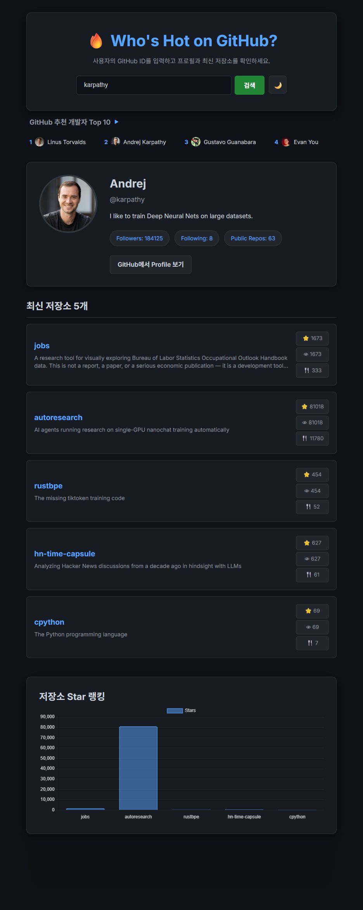
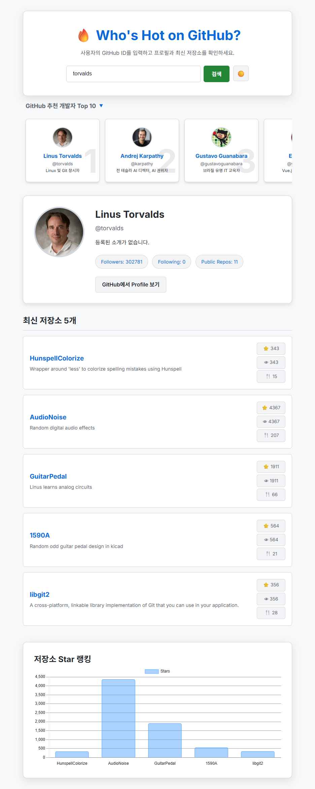

# 🔥 Who's Hot on GitHub?

GitHub 사용자의 프로필과 최신 저장소를 한눈에 확인하고, 영향력 있는 개발자들의 랭킹을 실시간 티커로 확인할 수 있는 모던한 웹 애플리케이션입니다.

<p align="center">
  
  
</p>

## 🚀 프로젝트 개요
이 프로젝트는 GitHub API를 활용하여 사용자가 입력한 ID의 상세 정보를 시각화하여 보여줍니다. 단순히 정보를 나열하는 것에서 벗어나, 전 세계 유명 개발자들의 큐레이션 정보를 제공하고 데이터 시각화 라이브러리(Chart.js)를 통해 저장소의 인기도를 분석합니다.

## ✨ 주요 기능
- **실시간 사용자 검색**: GitHub ID를 통해 프로필 이미지, 바이오, 팔로워 정보를 즉시 가져옵니다.
- **최신 저장소 분석**: 가장 최근에 업데이트된 5개의 저장소를 보여주며, 각 저장소의 Star, Watcher, Fork 수를 깔끔한 배지로 정렬하여 표시합니다.
- **데이터 시각화 (Chart.js)**: 검색된 저장소들의 Star 개수를 막대그래프로 하단에 렌더링하여 인기도를 한눈에 비교할 수 있습니다.
- **추천 개발자 큐레이션**:
  - **확장 모드**: 유명 개발자 10인의 상세 정보와 배경 순위 숫자를 카드 형태로 보여줍니다.
  - **축소 모드 (Ticker)**: 검색 후에는 공간 확보를 위해 이름과 사진이 흐르는 티커 형태로 자동 전환됩니다.
- **예외 처리**: 존재하지 않는 아이디(404)나 빈 입력에 대해 사용자 친화적인 에러 메시지를 제공합니다.
- **반응형 다크 모드**: GitHub의 감성을 담은 다크 테마와 모바일에서도 쾌적한 반응형 디자인을 제공합니다.

## 🛠 기술 스택
- **Language**: HTML5, Vanilla JavaScript (ES6+)
- **Styling**: Vanilla CSS (Custom Properties, Flexbox, Grid, CSS Animation)
- **Library**: [Chart.js](https://www.chartjs.org/)
- **API**: [GitHub REST API](https://docs.github.com/en/rest)

## 📂 프로젝트 구조
```text
.
├── index.html      # 메인 HTML 구조 및 외부 라이브러리 로드
├── style.css       # 다크 테마 및 애니메이션(티커, 카드 등) 스타일링
├── app.js          # [Refactored] OOP 기반 상태 관리 및 컴포넌트 로직
├── prompt.md       # 개발 과정에서 사용된 프롬프트 기록
└── README.md       # 프로젝트 설명서
```

## 🏗 리팩토링 및 코드 개선 사항

초보자도 코드를 쉽게 읽고 관리할 수 있도록 단계별로 리팩토링을 진행했습니다.

### 1차 리팩토링: 기능 분리 및 가독성 개선
- **코드를 역할별로 나누어 정리 (서랍장 정리)**: "데이터 가져오는 역할", "화면에 그려주는 역할", "클릭 이벤트 처리" 등으로 나누어 유지보수성을 높였습니다.
- **읽기 편한 최신 문법 사용**: 템플릿 리터럴을 사용하여 HTML 구조가 한눈에 들어오도록 정리했습니다.
- **친절한 검색 상태 표시**: "검색 중..." 메시지와 버튼 비활성화를 통해 사용자 경험을 개선했습니다.
- **에러 상황 대비 (방어적 코드)**: 404 에러나 네트워크 오류에 대비한 예외 처리 로직을 강화했습니다.
- **색상 변수 활용 (테마 바꾸기)**: CSS 변수를 활용하여 다크/라이트 모드 전환 시스템을 구축했습니다.

### 2차 리팩토링 (2026.05.15): OOP 및 상태 기반 아키텍처 도입
- **객체지향 프로그래밍(OOP) 도입**: 코드를 독립적인 책임을 가진 **클래스(Class)** 단위로 재설계했습니다. (`Store`, `GithubService`, `Component` 등)
- **상태(State) 기반 렌더링**: 화면을 직접 수정하는 대신, 데이터 상태가 변하면 UI가 자동으로 반응하여 업데이트되는 고급 아키텍처를 도입했습니다.
- **관찰자 패턴(Observer Pattern) 활용**: `Store`의 상태 변화를 여러 컴포넌트가 동시에 감지하고 최신 상태를 유지하도록 시스템을 구축했습니다.
- **성능 및 UX 최적화**: `Promise.all`을 이용한 병렬 데이터 페칭과 검색 시 추천 섹션 자동 축소 로직을 추가했습니다.

## ⚙️ 설치 및 실행 방법

- GitHub 저장소 : https://github.com/hong-vibe/20260514-GitHub-Finder

- GitHub pages : https://hong-vibe.github.io/20260514-GitHub-Finder/

1. GitHub pages의 링크를 클릭하여 웹앱을 실행시킵니다.

또는

1. 이 저장소를 클론하거나 다운로드합니다.
2. `index.html` 파일을 크롬이나 웨일 등 최신 브라우저에서 엽니다.
3. 별도의 빌드 과정이나 서버 설정 없이 즉시 사용 가능합니다.

- 주의 사항 : GitHub API는 시간당 60회의 호출만 가능합니다. 내용이 출력되지 않는다면 호출회수 초과입니다. 

## 📄 라이선스
이 프로젝트는 교육적 목적으로 제작되었으며, 누구나 자유롭게 참고하고 수정할 수 있습니다.

---

## 5. AI 활용 기록

### 🤖 사용한 프롬프트
- 본 프로젝트의 모든 개발 단계는 AI와의 협업을 통해 진행되었으며, 전체 프롬프트 이력은 [prompt.md](./prompt.md) 파일에 상세히 기록되어 있습니다.
- **주요 프롬프트 예시**:
  - "GitHub 추천 개발자 Top 10 섹션을 첫 화면에서는 상세 정보 카드로, 검색 후에는 티커 형태로 자동 전환되게 하세요."
  - "시니어 개발자의 관점에서 전체 코드를 관심사 분리 및 모던 문법으로 리팩토링하세요."
  - "다크 모드와 라이트 모드 전환 기능을 추가하고 설정을 저장하세요."

### 💡 AI 결과 중 수정한 부분
- **추천 개발자 데이터**: AI가 제안한 초기 유명 개발자 리스트를 실제 최신 팔로워 순위 데이터(Andrej Karpathy 등 포함)로 전면 교체하였습니다.
- **UI 레이아웃**: 테마 토글 버튼의 위치를 사용자 편의를 위해 우측 상단에서 검색창 내부로 이동하고 스타일을 조정했습니다.
- **저장소 목록**: 저장소 정보 옆에 설명을 추가하고, 통계 배지를 세로로 배치하여 가독성을 높였습니다.

### 🧠 직접 이해하고 바꾼 부분
- **CSS 변수 설계**: 테마 전환을 단순히 클래스 교체가 아닌 `:root` 변수를 활용한 시스템으로 설계하여 유지보수성을 높였습니다.
- **차트 연동 로직**: 테마가 바뀔 때 Chart.js 인스턴스를 파괴하고 다시 그리는 과정에서 데이터 손실이 없도록 캐싱 로직을 추가했습니다.

### 🛠 AI 도움 없이 직접 해결한 부분
- **프로필 카드 간격 조정**: 버튼과 배지 사이의 답답한 여백을 직접 스타일 시트에서 수정하여 시각적 완성도를 높였습니다.

---

## 6. 회고

### 🧐 어려웠던 점
- 초보자로서 코드를 여러 개의 함수로 나누고 정리하는 과정이 생소했습니다. 
- GitHub API의 호출 제한 문제로 인해 실시간 데이터를 가져올 때 발생할 수 있는 에러 상황들을 처리하는 것이 까다로웠습니다.

### ✅ 해결 방법
- 복잡한 코드를 "서랍장 정리"하듯 역할별로 분리하면서 코드의 흐름을 이해하려고 노력했습니다.
- 에러 처리 로직을 추가하여 문제가 생겨도 앱이 멈추지 않고 사용자에게 안내되도록 개선했습니다.

### 🚀 다음에 개선하고 싶은 점
- 코드를 더 깔끔하게 나누는 연습을 지속하여 나중에 봐도 바로 이해되는 코드를 짜고 싶습니다.
- 사용자 편의를 위해 검색 히스토리 저장 기능을 추가해보고 싶습니다.
